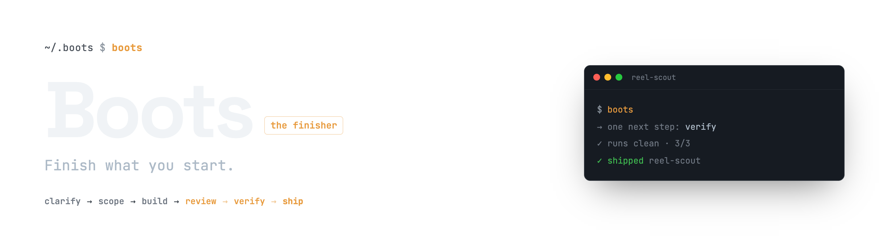

<p align="center">
  
</p>

<p align="center">
  <a href="#install--one-paste"><strong>Install</strong></a> &middot;
  <a href="#how-you-use-it"><strong>How you use it</strong></a> &middot;
  <a href="#the-pipeline"><strong>The pipeline</strong></a> &middot;
  <a href="#privacy--telemetry"><strong>Privacy</strong></a> &middot;
  <a href="https://github.com/Fourday-AI/boots"><strong>GitHub</strong></a>
</p>

<p align="center">
  <a href="LICENSE"></a>
  <a href="https://github.com/Fourday-AI/boots/stargazers"></a>
  
</p>

<br/>

# Boots is the companion that helps you *finish* AI systems.

A build-and-close pipeline for Claude Code.

I kept starting AI systems and never finishing them. A skill half-built in one chat, an idea clarified in another, a tool that "worked" only because I remembered its tricks — all scattered across sessions I'd never reopen. Every toolkit I tried helped me *start* faster, which just gave me more half-built things. So I built the part that was missing: the one that closes. Boots is what I use to make finishing the default.

**If Claude Code is the _builder_, Boots is the _finisher_.**

Boots is a suite of Claude Code skills that keeps track of every AI system you have going, tells you the one next step, and walks each one from a fuzzy idea all the way to a finished, usable tool. Bring a half-formed ambition; Boots works out where you actually left off, in your own words, and moves it forward one concrete step at a time.

Every builder toolkit helps you _start_. Boots also **closes** — review it, prove it works, and ship it are real steps, because a system isn't done until it's actually shipped.

**The failure mode Boots fights is abandonment.** People start systems and forget them. Boots makes forgetting impossible and finishing the default.

|        | Step            | Example                                                                              |
| ------ | --------------- | ------------------------------------------------------------------------------------ |
| **01** | Clarify         | _"I want AI to grade the freelance editors applying to my brand."_ → a real outcome. |
| **02** | Scope & build   | Cut to the smallest useful version, pick what to build (a skill, an automation, a script…), build it. |
| **03** | Close           | Review what's wrong, prove it actually runs, ship the finished tool.                 |

<br/>

## How you use it

You don't memorize a pipeline. You say one word:

```
boots
```

Boots looks at every system you have going, checks what it remembers against what actually got built, and tells you the **one next step** — in your own words, not a stage name. Do that step, say `boots` again, and it moves you forward. That's the whole loop.

The stages below run in an order, and Boots knows it so you don't have to. Say `boots`, then just describe the idea — Boots reframes it, cuts it down, builds it, checks it, proves it, and ships it, offering each next step in plain English as you go. You never type a stage name. (You *can* invoke a stage directly if you want the manual controls, but you never have to.)

> **Why this matters if you don't code:** every other builder toolkit hands you a menu of commands and expects you to know which one, in what order. Boots holds the order for you. The only command you have to remember is `boots`.

### See it work

A full build, stage by stage. Run each stage yourself like this — or just say `boots` and it drives the whole pipeline for you, offering each step in plain English.

```
You:    I want AI to grade the freelance editors applying to make reels for my brand.
You:    boots-clarify

Boots:  I'm going to push back on the framing. You said "grade editors" — but grading
        isn't the hard part; you can already tell a good reel from a bad one. What you
        actually want is a taste-first shortlist: the eye decides it, editing is a floor.
        [reframes the problem, spells out what it really needs to do]
        [writes down what you're really building, in your own words]

You:    boots-scope
        [cuts to the smallest useful version: read each CV + links, open their real
         reels and Instagram, rank on taste, return a shortlist with one line each]
        [picks what to build: a skill. Scoring dashboards + auto-emails → left for later]

You:    boots-build
        [builds the skill and drops it in place — a few minutes]

You:    boots-review
        [FOUND] it grades from the CV text instead of opening the reels — defeats the point
        [AUTO-FIXED] now opens the real work first and judges the eye

You:    boots-verify
        [runs it on 3 real applications, end to end — top pick matches your gut]
        [GAP] two portfolios were behind a Linktree; clicked through by hand

You:    boots-ship
        [heals the Linktree gap into the skill so it handles them itself next time]
        Shipped. Ran clean on all 3. "reel-scout" is a real skill now — invoke it any time.
```

You said "grade editors." Six commands later you have a taste-first talent scout that opens real work, ranks it, and improved itself along the way. Or skip the commands entirely — say `boots` and it walks the same pipeline for you.

<br/>

<div align="center">
<table>
  <tr>
    <td align="center"><strong>Builds<br/>any form</strong></td>
    <td align="center"><sub>Skill</sub></td>
    <td align="center"><sub>Agent</sub></td>
    <td align="center"><sub>Slash command</sub></td>
    <td align="center"><sub>Automation</sub></td>
    <td align="center"><sub>Connector</sub></td>
    <td align="center"><sub>App</sub></td>
    <td align="center"><sub>Script</sub></td>
    <td align="center"><sub>Notes</sub></td>
  </tr>
</table>

<em>Boots builds whatever the job needs — picked from the work itself, not from whatever project you happen to be in.</em>

</div>

<br/>

## Boots is right for you if

- ✅ You **start more AI systems than you finish** and lose track of the half-built ones
- ✅ You want a companion that **remembers where every system stands** and always has the next step
- ✅ You build with **Claude Code** and want everything it can build — skills, agents, automations, scripts — treated as real work, not just loose files
- ✅ You want the **closing** work — review it, prove it works, ship it — to be a real process, not a vibe
- ✅ You want a pickup to **feel like the last chat never closed** — your situation in your own words, not a stage name
- ✅ You want Boots to **dig through your old chats, notes, and to-do lists** for work worth building

<br/>

## Features

<table>
<tr>
<td align="center" width="33%">
<h3>🧭 One next step</h3>
Boots looks at everything you have going and gives you a single concrete move — not a status dump.
</td>
<td align="center" width="33%">
<h3>🏁 It actually finishes</h3>
Review it, prove it works, and ship it are separate, deliberate steps. A tool isn't done until it's really done.
</td>
<td align="center" width="33%">
<h3>🧱 Any form</h3>
Whatever the job needs — a skill, an agent, an automation, a connector to another tool, a script, or a piece of reference.
</td>
</tr>
<tr>
<td align="center">
<h3>🔗 Picks up where you left off</h3>
Open a new chat and it feels like the last one never closed — Boots starts you back in your own situation, in your words.
</td>
<td align="center">
<h3>🩹 Never loses your progress</h3>
If a chat did the work but forgot to write it down, Boots spots what actually got built and catches its record up — so you never redo a finished step.
</td>
<td align="center">
<h3>⛏️ Finds work worth doing</h3>
Boots digs through everywhere your unfinished ideas pile up — past chats, notes-to-self, to-do lists, other AI tools — and hands you a ranked list.
</td>
</tr>
<tr>
<td align="center">
<h3>🧠 Gets smarter each time</h3>
Every finished tool teaches Boots something it applies to the next one — your work builds on itself instead of starting over.
</td>
<td align="center">
<h3>🧹 Knows when to let go</h3>
When a system's gone cold, Boots suggests dropping it — so your list stays honest, not a graveyard of things you'll never finish.
</td>
<td align="center">
<h3>📁 Remembers everything for you</h3>
Nothing has to live in your head between steps. Boots keeps its own running notes so you can walk away and pick up cold.
</td>
</tr>
</table>

<br/>

## Problems Boots solves

| Without Boots                                                                                     | With Boots                                                                                              |
| ------------------------------------------------------------------------------------------------- | ------------------------------------------------------------------------------------------------------- |
| ❌ You start ten AI systems and finish two. The rest rot half-finished across old chats you'll never reopen. | ✅ Every system is tracked with where it's up to and its one next step. Abandonment becomes visible and fixable. |
| ❌ You open a chat and spend ten minutes re-deriving where you left off.                          | ✅ Boots opens with exactly where you left off, in your own words — the pickup feels like the same chat. |
| ❌ A tool "works on your machine" because you carried its tricks in your head.                    | ✅ Boots writes down every step you did by hand, then folds each one into the tool itself before it's done — so it works without you next time. |
| ❌ "What should I build next?" has no grounded answer, so you thrash.                             | ✅ Boots digs through your old chats, notes, and to-do lists and hands back a ranked list of what's worth building, with the reason for each. |
| ❌ You build the same class of thing twice because the last lesson stayed in a chat.              | ✅ Boots captures what each finished tool taught and applies it next time — so you don't rebuild the same thing twice. |
| ❌ "Done" means "it ran once," so half-finished tools pile up as finished-looking ones.           | ✅ Done means reviewed, proven to work, and shipped. Boots won't let a system fake completion.          |
| ❌ A shipped tool quietly breaks — runs fine but gives the wrong answer — and you find out weeks later, by accident. | ✅ Boots keeps watching live systems: whenever you open it, it checks each one still works *and still gives the right answer*, then evolves it with you. |

<br/>

## Why Boots is special

Boots handles the unglamorous "finish it" details correctly.

|                                   |                                                                                                            |
| --------------------------------- | ---------------------------------------------------------------------------------------------------------- |
| **It really finishes.**           | Reviewing, proving it works, and shipping are different jobs, so Boots does them as separate steps — nothing gets a single "looks done" rubber-stamp. |
| **It trusts reality, not its notes.** | Before Boots tells you where things stand, it checks its own notes against what actually got built — and if they disagree, what's real wins. |
| **It builds the right kind of thing.** | Boots picks what to build from what the job actually needs — not from whatever the project you're in happens to be made of. |
| **It proves things really work.** | "Works" means Boots actually runs the thing the way you would — not just "the tests passed." |
| **Nothing you did by hand is forgotten.** | Every manual step you took to make it run gets built into the tool — or noted out loud as left for later — before it ships. |
| **Lessons stick.**                | When a finished tool teaches you something, Boots doesn't just remember it — it changes the tool to obey it. |
| **Shipping isn't the end.**       | Boots keeps watching live systems and checks the *answer*, not just that the job ran — because a tool can run green and be silently wrong. When it drifts, Boots evolves it with you. |

<br/>

## The pipeline

A system moves through steps. Each step is a skill. Each one writes down what it did in a plain notes file; the next one reads it. Nothing lives in your head between steps.

```
   clarify → scope → build → review → verify → ship
                               └───────── the closer ─────────┘

   run any time:
   prospect · track · surface · rethink · observe · extract · retire
```

After a system ships, `observe` keeps watching it — because shipping isn't the end. When Boots
opens, it checks each live system is still working *and still giving the right answer* (not just
that it ran), and evolves it with you.

And every so often, `rethink` steps back over *all* of it. Each stage above moves one system one
step forward — which means none of them can ask whether you're building the right things at all.
People assemble a machine one piece at a time and never get told what the machine is. Rethink is
the step that reads everything you have, says what it adds up to, and tells you when two of your
systems are really the same job, or when the piece that would tie them together doesn't exist yet.
It's the one part of Boots allowed to disagree with your plan.

### The stages

<table>
<tr>
<td width="50%">

**`boots` (the router)** — Checks where every system stands against what actually got built, and gives you the one next step in your own words. Start here.

</td>
<td width="50%">

**`clarify`** — Turns a vague "I want AI to do X" into something real: the actual problem, what it needs to do, and a paragraph in your own words. Writes down where it stands.

</td>
</tr>
<tr>
<td>

**`scope`** — Cuts a clarified system to its smallest useful version, names what's out, and decides what to build (a skill, an agent, an automation, a connector, a script, or notes).

</td>
<td>

**`build`** — Makes the scoped slice in the chosen form, in the right place for Claude Code to find it. Produces the thing the closer then reviews, proves out, and ships.

</td>
</tr>
<tr>
<td>

**`review`** — Finds what's wrong, missing, or half-done — checked the right way for what it is — and writes the gaps back as concrete next steps.

</td>
<td>

**`verify`** — Proves the system works by actually running it end to end, the way that fits what it is, and writes down every step you had to do by hand.

</td>
</tr>
<tr>
<td>

**`ship`** — Produces the finished, usable tool, folds in each manual step verify found, and marks the system done. A system isn't done until it's shipped.

</td>
<td>

**`prospect`** — The feeder. Digs through Claude Code's memory, your past chats, a loose-ends list, to-do notes in your projects, and other AI tools for work worth doing, then ranks it.

</td>
</tr>
<tr>
<td>

**`track`** — Turns a loose, abandoned thread into a tracked system with a spot on your list, a plan for what it'll be, and a next step, so it stops rotting and enters the pipeline.

</td>
<td>

**`surface`** — The heads-up. Looks across everything you have going and says the single most useful next step — or a grounded "nothing's stuck."

</td>
</tr>
<tr>
<td>

**`rethink`** — Steps back over everything you've built and works out what it adds up to. Tells you when two systems are doing the same job, when nothing carries what one found to the one that needs it, and when the piece that would finish the picture doesn't exist yet. The only part of Boots that argues with your plan.

</td>
<td>

**`extract`** — After a system ships, captures what it taught, routes the lesson everywhere that fits, and asks whether it's a rule the tool itself must now obey.

</td>
</tr>
<tr>
<td>

**`retire`** — Proposes dropping systems, rules, or tools that have gone cold, so your list stays honest and Boots can subtract, not only add.

</td>
<td>

**`observe`** — The steward for live systems. When Boots opens, it checks each shipped system is still alive, that its latest output actually makes sense (**not just that it ran**), and that you're using it — then proposes concrete fixes and makes them with you. The step that keeps shipped tools from silently breaking.

</td>
</tr>
</table>

<br/>

## What Boots is not

|                              |                                                                                                        |
| ---------------------------- | ------------------------------------------------------------------------------------------------------ |
| **Not an agent framework.**  | Boots doesn't tell you how to build agents. It tells you how to finish the systems you build with them. |
| **Not just a chatbot.**      | Yes, you talk to it — but it isn't a blank chat window you have to steer. Boots keeps track of every system you're building and drives each one to finished. |
| **Not a task manager.**      | Tasks are a side effect. Boots tracks systems, what each one is, and whether it's actually shipped.      |
| **Not a workflow builder.**  | No drag-and-drop pipelines. The pipeline is a fixed set of steps that each do real, different work.      |
| **Not tied to one project.** | Boots works in any project and builds anything Claude Code can. What it builds follows the work.         |

<br/>

## Install — one paste

Boots is a set of Claude Code skills. There's no build step, no server, no account — you install the skills and wire them into `CLAUDE.md` so the agent knows they exist.

**Requirements:** [Claude Code](https://claude.com/claude-code) and [Git](https://git-scm.com/). That's it.

Open Claude Code and paste this. Claude does the rest:

> Install Boots: run `git clone --depth 1 https://github.com/Fourday-AI/boots.git ~/.claude/skills/.boots && ~/.claude/skills/.boots/setup`, then add the `## Boots` section it prints to my CLAUDE.md.

Or do it by hand:

```bash
git clone --depth 1 https://github.com/Fourday-AI/boots.git ~/.claude/skills/.boots
~/.claude/skills/.boots/setup     # global; or `… /setup --project` for one repo
```

Boots clones straight into your Claude Code skills directory, so the download *is* most of the install. The leading dot in `.boots` is load-bearing: Claude Code skips dot-directories when it looks for skills, so the repo itself is never mistaken for one and the router keeps the plain name `boots` you type. `setup` then symlinks each `boots*` folder alongside it and prints a `## Boots` block to paste into `CLAUDE.md` so the agent discovers the suite. Uninstall with `~/.claude/skills/.boots/setup --uninstall`.

**Upgrading:** just say `boots-upgrade` — Boots pulls the new version, re-runs setup, and applies any migrations. It also notices new versions on its own and offers. By hand it's `cd ~/.claude/skills/.boots && git pull && ./setup` — run `setup` too, not `git pull` alone, since that's what applies migrations. Because the skills are symlinked, one upgrade updates every project at once.

> Your work is kept somewhere else. `~/.boots/` holds your systems, notes and config; the clone above is only the program. Deleting or re-cloning the repo never touches them.

### Try it in five minutes

1. Install (above).
2. Say `boots`, then describe one fuzzy "I want AI to do X" you keep meaning to build.
3. Just talk — react to what it asks, say yes when it offers to build. It drives.
4. Keep going until it says the system is shipped.
5. Stop there. You'll know if this is for you.

<br/>

## FAQ

**What is a "system" in Boots?**
Anything you build with Claude Code — a skill, an agent, an automation, a slash command, a connector to another tool, a script, or a piece of reference it reads — or a small mix of these. (In Claude Code's own terms: skills, subagents, slash commands, hooks, MCP servers, Agent SDK apps, scripts, and durable context.) Boots picks which one from what the job needs.

**Where does Boots keep track of things?**
Boots keeps plain notes files as it works — one per system, plus a short summary of each chat. They live in one fixed place on your own machine — `~/.boots/systems/` — deliberately **not** inside whatever project you happen to be working in. A system is your work, not your repo's, so you can pick it up from any directory, and it never ends up committed to a codebase you push. Nothing depends on you remembering. You don't need to read the files either — ask Boots about a system and it reads the record back to you.

**How is this different from a task manager or a builder toolkit?**
Toolkits help you start; task managers track titles. Boots follows a tool through its whole life and, crucially, **finishes** it — reviews it, proves it works, ships it — so half-built tools stop piling up looking done.

**Do I have to use every stage?**
No. Run `boots` and it routes you to the stage a system actually needs. The anytime skills (prospect, track, surface, observe, extract, retire) run whenever you like.

<br/>

## Roadmap

- ✅ Full build-and-close pipeline (clarify → scope → build → review → verify → ship)
- ✅ Never lose your place — every system remembers where you actually are
- ✅ Self-healing — Boots catches a chat that did the work but forgot to write it down
- ✅ Finds work — digs through your chats, notes, and to-dos for what's worth building
- ✅ Learns — lessons from finished tools become rules the next one follows
- ✅ Watches live systems — checks a shipped tool still works *and still gives the right answer*, and evolves it with you
- ✅ Builds any form — skill, agent, automation, connector, app, script, or notes
- ⚪ Support for other AI tools beyond Claude Code
- ⚪ Packaged as an installable Claude Code plugin / marketplace entry
- ⚪ Finds work in more places (more sources it can dig through)

<br/>

## Privacy &amp; telemetry

**Off by default. Nothing leaves your machine unless you turn it on.**

Everything Boots writes about your work — the systems, the session notes, the map of
what you're building — is plain files in `~/.boots/` on your own machine. Boots never
sends any of it anywhere.

Separately, there is an optional, opt-in telemetry channel that helps us see whether
Boots actually gets people to *finished* — where systems stall, which stage loses
people. You're asked once, plainly, and you can say no and never hear about it again.
There are three settings:

| setting | what leaves your machine |
|---|---|
| `off` *(default)* | **nothing.** |
| `anonymous` | the records below, with no device id at all |
| `community` | the same, plus a random per-install id, so one install's path through the pipeline can be followed end to end |

The records are: a stage transition (`scope → build`), whether it advanced, stalled or
was abandoned, the system's form and platform (`skill`, `claude-code`), your OS name,
and which skill ran, for how long, and whether it succeeded.

(Boots keeps a local record of your own pipeline regardless of this setting — that's
what lets it tell you where things are stuck. The setting governs uploading, and only
uploading.)

The system's name is **hashed** before it leaves — salted with a random value
generated on your machine, so the same name on two installs produces two unrelated
hashes, and no hash can be reversed. The per-install id is random, not derived from
your machine. Your repo's name is recorded locally so Boots can find your work across
directories, and is stripped before upload.

What is **never** sent: the content of any system, your notes, prompts, code, file
paths, repo names, or anything you typed. Only the shape of the funnel.

```bash
~/.claude/skills/boots/bin/boots-config get telemetry   # off | anonymous | community
~/.claude/skills/boots/bin/boots-config set telemetry off
```

The backend is in [`supabase/`](supabase/) — schema, edge functions and all — so you
can read exactly what is accepted and stored rather than taking our word for it. The
client side is one readable shell script:
[`boots-telemetry-sync`](boots/bin/boots-telemetry-sync).

Boots also checks for updates by asking your git remote whether the clone is behind.
That's a plain `git` call to wherever you cloned from, and it's off with
`boots-config set update_check false`.

<br/>

## Contributing

Contributions are welcome. See [CONTRIBUTING.md](CONTRIBUTING.md) — the one rule worth
knowing up front is that the skills are **generated from `.tmpl` templates**, so you
edit the template and regenerate, never the `SKILL.md`.

<br/>

## License

MIT &copy; 2026 Fourday AI

<br/>

---

<p align="center">
  <sub>Open source under MIT. Built for people who start more AI systems than they finish.</sub>
</p>
